# **Dashboard de Ventas**
Bootcamp Xperience

## Información
Aplicación en línea que muestra información consolidadada por regiones, ciudades, vendedores y productos de la evolución de compras en una tienda ubicada en el territorio brasilero. 
Dashboard interactivo de una empresa de e-commerce desplegado en la plataforma Streamlit.

## Paso a Paso
Detalle del tratamiento de los datos. Obtención, estandarización y consolidación de los datos.

1) El Negocio. El Cliente.

Una tienda en línea, de artículos de moda, con presencia en todo Brasil, necesita impulsar su rendimiento utilizando sus datos de manera estratégica.
Como científicos de datos, hemos sido convocados para analizar datos de transacciones de tres períodos calendario y ofrecer una vison interna profunda sobre los consumidores que guíen sus decisiones respondiendo a preguntas clave:
                    
                    ¿Cuál es el Top 5 productos más vendidos históricamente?

                    ¿Cuál es la evolución histórica de las ingresos netos?

                    ¿Cuáles son los ingresos netos por vendedor por año?

                    ¿Cuáles son las ciudades que proporcionan mayores ingresos netos?

                    Otro insight. 
 
2) Obtención, Tratamiento y Análisis Exploratório (EDA)

Proceso de investigación en el que, usando estadísticas de resumen y herramientas gráficas, se llega a conocer los datos y comprender lo que se puede averiguar de ellos.

Diagnóstico:
Se identificaron inconsistencias en cuanto al producto_id -únicos (205)- y producto -únicos (201)- determinando lo siguiente:

a) Calca Alfaiataria Preta 2--->2 marcas (Mixed y Lelis Blanc): Justificado

b) Saia Pregas Preta       2--->1 marca (Zara) precios distintos: Injustificado

c) Vestido Recortes Cores  2--->2 marcas (Alix Shop y Bcbgmaxzria): Justificado

d) Calca Jeans Costuras    2--->2 marcas (Seven y Diesel): Justificado

Consideramos justificada la diferencia en el mismo producto cuando son de marcas diferentes, lo que genera SKU y producto_id diferentes, también precio. Sin embargo, el producto Saia Pregas Preta, es la misma marca, el mismo nombre, pero con precios y id distintos. Se decide dejar esos datos considerando que pueden ser de tallas distintas y de precio mayor o que tienen un diferente calidad.

### Gráficos explicativos
  Histogramas
  
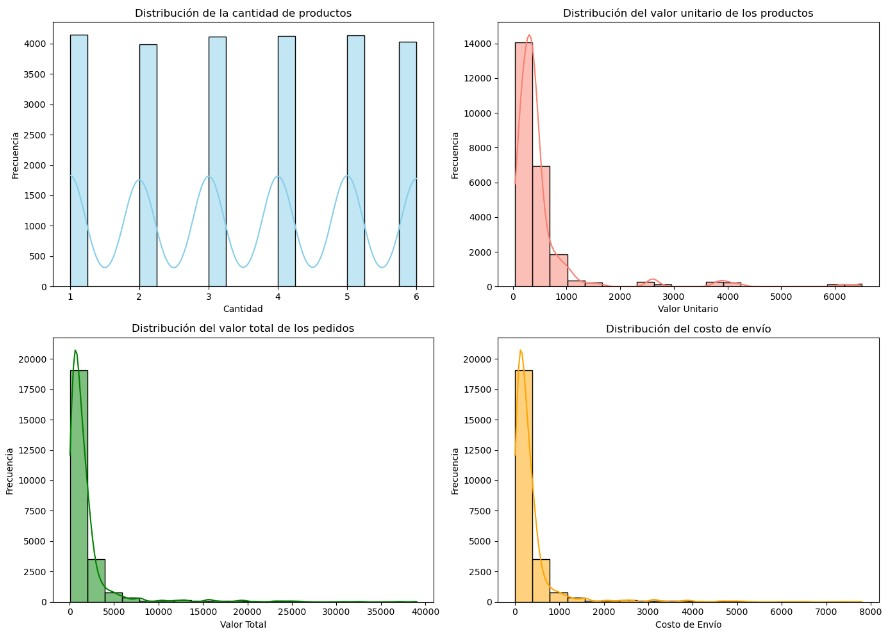

  Distribución de Pedidos por Ciudad

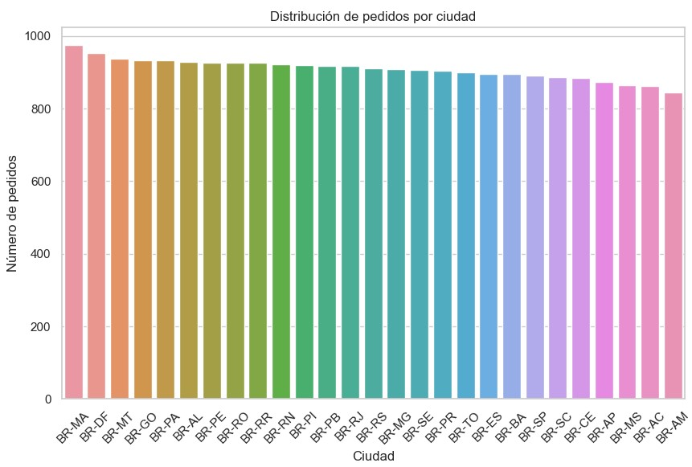

  Distribuciones con Diagramas de Caja (Bloxplot) Exploratorios

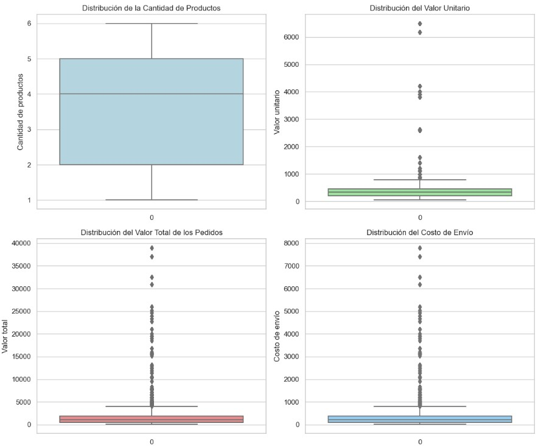

  Distribución con Densidad de Montos de los Pedidos

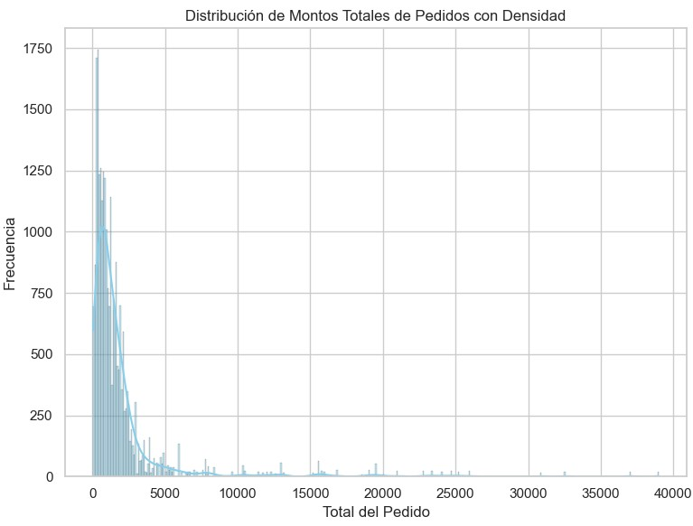

  Cantidad de Pedidos Por Vendedor
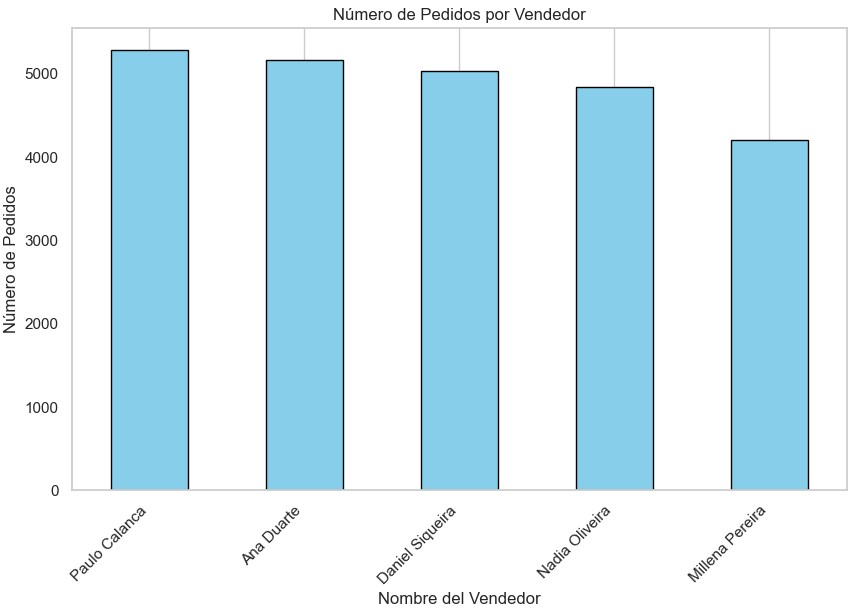

  Evolución Total de Pedidos en el Tiempo
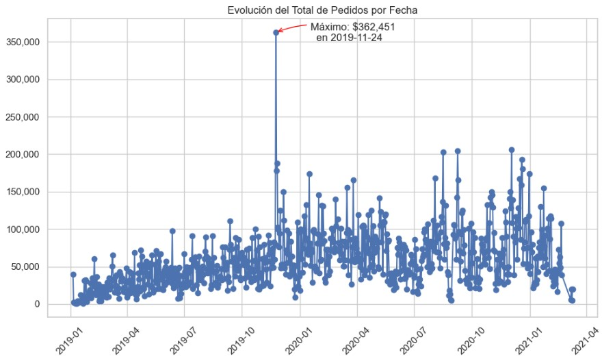

  Productos por su Condición
  

  Distribución de Precios por Condición
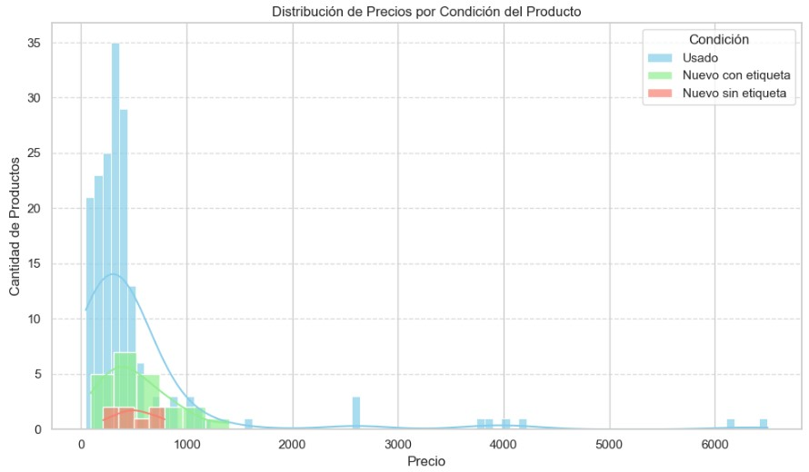

  Ventas por Mes por Año
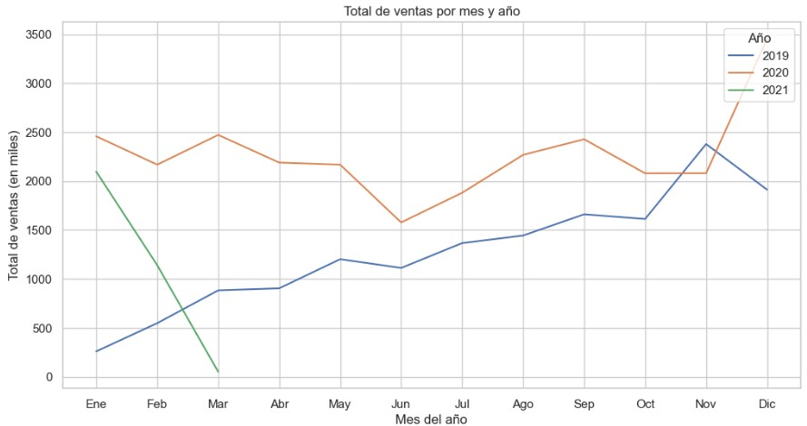

## Tablero de Ventas 

Funcionalidades:   Cuadros -   Filtros  - Gráficos

  Página Principal
  
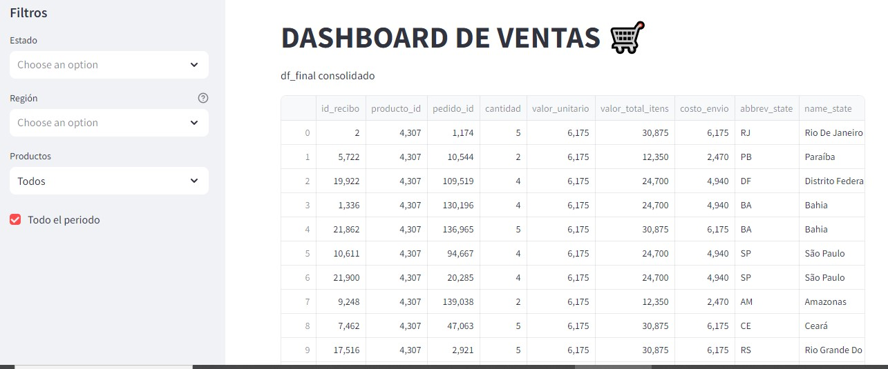

  Filtros Habilitados para Selecciones

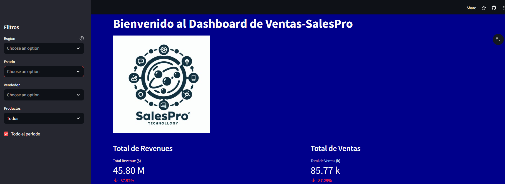

  Ejemplo Filtro por Estado

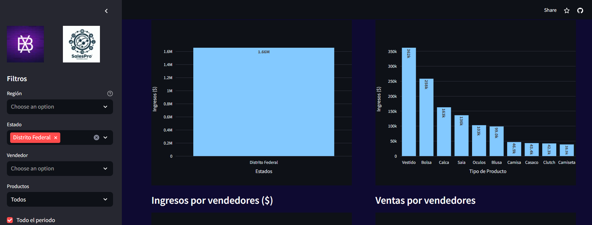

  Selección de Ventas de un producto por Vendedores
  
  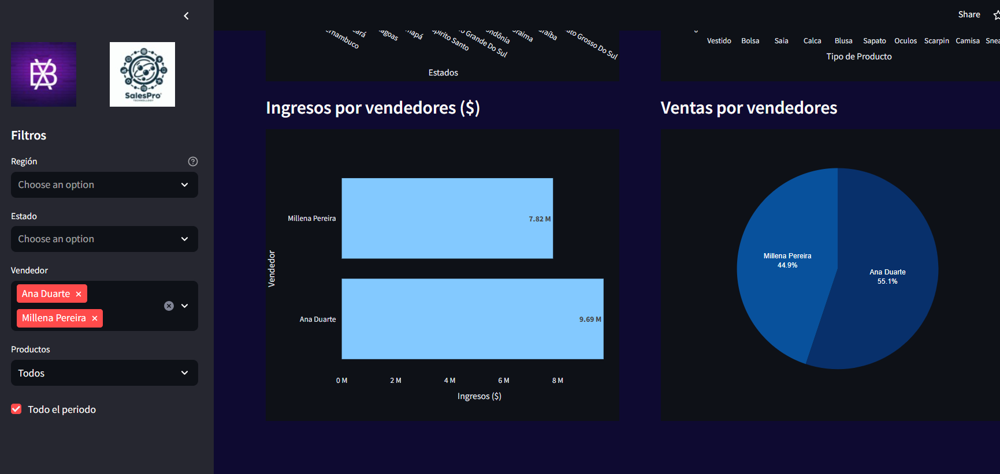
  
## <h3 align="center">🛠️ Miembros del Equipo</h3>
 

 

|Participantes|Roles|Redes|
|:---:|:---:|:---:|
|**Mirna**|| <a target="_blank" rel="noopener noreferrer" href="https://www.linkedin.com/in/mirna-prieto-990356242/">
|**Edwin Garcia**| |  |
|**Juan Campos**|| <a target="_blank" rel="noopener noreferrer" href="https://www.linkedin.com/in/jumacaq/"></a> |
|**Leopoldo Flores**|| <a target="_blank" rel="noopener noreferrer" href="https://www.linkedin.com/in/leopoldofloresc/"></a> |
|**Alexangel Bracho**|| <a target="_blank" rel="noopener noreferrer" href="https://www.linkedin.com/in/alexangel-bracho-m-sc-in-physics-510675239/"></a> |

 

## <h2>🚧 Stack de Tecnologías </h2>

